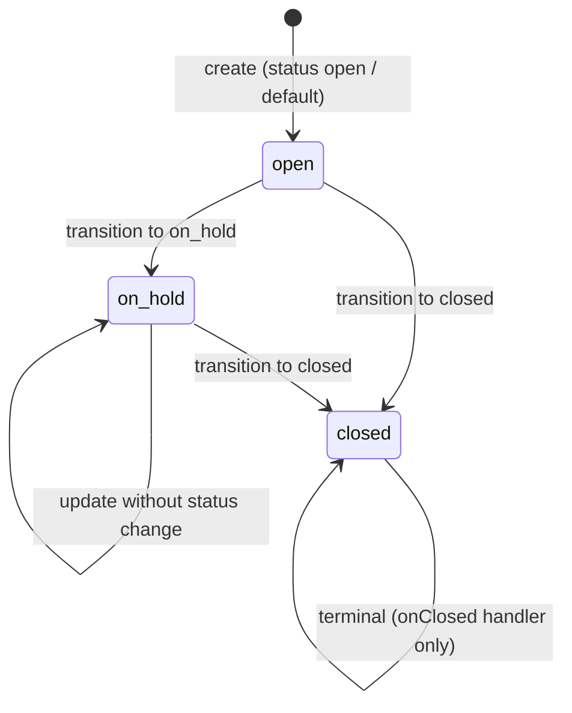

# State Machine Codegen — go-boilerplate-clean

Rules for generating a **state machine** for entities with a `status` field (or similar workflow). Reference implementation:

```
internal/usecase/sample/
├── saver.go              # orchestration: tx + state machine + persist + publish
├── getter.go             # (placeholder — implement when repo exists)
├── states/
│   ├── state.go          # factory, interfaces, main machine
│   ├── open.go           # state: open
│   ├── on_hold.go        # state: on_hold
│   └── closed.go         # state: closed
└── on_open/
    └── on_open.go        # transition handler (IOnStateTransition)
```

Entity & status constants: `internal/entity/sample/sample.go`

---

## When to use a state machine

Use this pattern when:

- The entity has a **status** that changes according to business rules (not a free-form field update).
- Status transitions have **different side effects** per target status (validation, notifications, recalculation, etc.).
- Save/create must be **atomic** inside a DB transaction.

Do not use a state machine for plain CRUD without workflow — usecase + repository is enough (see `internal/usecase/users`).

**End-to-end reference in this repo:** `POST /samples`, `PUT /samples/:id`, wired in `internal/bootstrap/wire.go` → `wireSampleService`.

---

## Create vs update

| Path | Request | `current` in factory | `storeFunc` | ID |
|------|---------|----------------------|-------------|-----|
| **Create** | `POST /samples`, body without `id` | `&sample` from request (no ID yet) | `adder.Add` | Generated in repository on persist |
| **Update** | `PUT /samples/:id` | Loaded via `getter.Get(id)` | `updater.Update` | Required in URL / entity |

Rules for `NewStateMachine(ctx, current)`:

1. **Do not require ID on create** — empty `current.ID` is valid; the repository assigns a UUID in `Add`.
2. **Default status** — if `current.Status` is empty, set `open` (or your initial status) in the factory before `switch current.Status`.
3. **Run the state machine inside the transaction** before `Add`/`Update`, so transition side effects roll back on failure.
4. **Publish events after commit** (see `saver.go`).

`Save` flow (simplified):

```
ID set? → getter.Get → current
current nil? → create: current = &request, storeFunc = Add
else → update: storeFunc = Update
NewStateMachine(current) → Begin tx → Do → Add/Update → Commit → Publish
```

---

## Status diagram (Sample example)



Constants in the entity:

| Constant | String value |
|----------|--------------|
| `SampleStatusOpen` | `open` |
| `SampleStatusOnHold` | `on_hold` |
| `SampleStatusClosed` | `closed` |

---

## Folder structure for a new domain `{domain}`

Replace `Sample` / `sample` with your domain name.

```
internal/usecase/{domain}/
├── saver.go                    # {Domain}Saver — Save() entry point
├── getter.go                   # load current record (for updates)
├── states/
│   ├── state.go                # factory + stateMachine{Domain}
│   ├── {state_a}.go            # one file per status
│   └── ...
└── on_{transition_name}/       # optional, one package per transition handler
    └── on_{transition_name}.go
```

---

## State machine prompt template

```markdown
Generate a state machine for domain `{domain}` in go-boilerplate-clean.

## Status & transitions
| Current status | Target status (from request) | Transition handler |
|----------------|------------------------------|--------------------|
| {current}      | {target}                     | on{Transition}     |
| ...            | ...                          | ...                |

## Entity
- Entity path: internal/entity/{domain}/{entity}.go
- Status constants: {Entity}Status{Name} = "{value}"

## Rules
Follow docs/statemachine.md and the pattern in internal/usecase/sample/states/*.

## Output files
- internal/usecase/{domain}/saver.go
- internal/usecase/{domain}/states/state.go
- internal/usecase/{domain}/states/{per_status}.go
- internal/usecase/{domain}/on_*/ (IOnStateTransition handlers)
- Wire factory in internal/bootstrap/wire.go
```

---

## Core interfaces (`states/state.go`)

### 1. `I{Domain}State`

A concrete state executes `Do` for transitions from that status.

```go
type ISampleState interface {
    Do(ctx context.Context, tx *gorm.DB, update sample.Sample) (sample.Sample, error)
}
```

### 2. `I{Domain}StateMachine`

Machine + access to current data after transition.

```go
type ISampleStateMachine interface {
    ISampleState
    Sample() *sample.Sample
}
```

### 3. Factory (called from saver)

The factory implements `NewStateMachine(ctx, current)` (no `tx` — transaction is passed into `Do`):

In saver, the interface is:

```go
type NewSampleStateMachine interface {
    NewStateMachine(ctx context.Context, current *entitysample.Sample) (states.ISampleStateMachine, error)
}
```

### 4. `IOnStateTransition`

Side-effect / validation handler per **transition type** (not per state file):

```go
type IOnStateTransition interface {
    OnStateTransition(ctx context.Context, tx *gorm.DB, update sample.Sample) (sample.Sample, error)
}
```

Factory handler naming in sample (adapt to your business):

| Factory field | Example semantics |
|---------------|-------------------|
| `onCreation` | stay / update in initial status (open → open) |
| `onPending` | move to waiting status (`on_hold`) |
| `onClosed` | close / terminal (`closed`) |

Minimal implementation (pass-through): `internal/usecase/sample/on_open/on_open.go`

---

## Factory & machine (`state.go`)

### `stateMachine{Domain}`

- Field `data *entity.{Entity}` — current snapshot.
- Field `current I{Domain}State` — active state.
- Field per status: `open`, `onHold`, `closed`, ... (private typed structs).

### `New{Domain}StateMachineFactory(...)`

- Accept all required `IOnStateTransition` handlers.
- `NewStateMachine(ctx, current)`:
  1. Initialize all state structs, set `stateMachine: sm`.
  2. Default `current.Status` to the initial status if empty.
  3. `switch current.Status` → set `sm.current` (empty ID is OK for create).
  4. Unknown status → `fmt.Errorf("unknown status: %s", ...)`.

### `Do` on the machine

Delegate to the current state:

```go
func (s stateMachineSample) Do(ctx context.Context, tx *gorm.DB, update sample.Sample) (sample.Sample, error) {
    return s.current.Do(ctx, tx, update)
}
```

---

## Per-state implementation (`open.go`, `on_hold.go`, ...)

Required pattern in every state file:

1. Private struct with `stateMachine *stateMachine{Domain}`.
2. References to transition handlers (`onCreation`, `onPending`, `onClosed`, ...).
3. In `Do`:
   - Set `s.stateMachine.data = &update` (mutate machine data).
   - `switch update.Status` (**target** status from the request) → call the matching handler.
   - Default branch → “stay in this state” / creation handler.

Example `open` (`internal/usecase/sample/states/open.go`):

```go
switch update.Status {
case sample.SampleStatusOnHold:
    return s.onPending.OnStateTransition(ctx, tx, update)
case sample.SampleStatusClosed:
    return s.onClosed.OnStateTransition(ctx, tx, update)
default:
    return s.onCreation.OnStateTransition(ctx, tx, update)
}
```

Example `closed` (terminal):

```go
return s.onClosed.OnStateTransition(ctx, tx, update)
```

**Codegen rule:** every allowed `(currentStatus, targetStatus)` pair must have a `switch` branch or handler; illegal transitions return an error from `OnStateTransition`, not from the HTTP handler.

---

## Saver / orchestration (`saver.go`)

`Save(ctx, entity)` flow:

```
1. If ID is set → getter.Get(current)
2. If current is nil → create path (storeFunc = adder.Add)
   else → update path (storeFunc = updater.Update)
3. stateMachine := factory.NewStateMachine(ctx, current)
4. tx := txManager.Begin(ctx)
5. updated := stateMachine.Do(ctx, tx, sample)
6. updated = storeFunc(ctx, tx, updated)   // persist
7. txManager.Commit(ctx, tx)
8. publisher.Publish(ctx, updated)           // optional, after commit
```

Interfaces defined in the usecase package (dependency inversion):

| Interface | Role |
|-----------|------|
| `SampleAdder` | insert new row |
| `SampleGetter` | load by ID |
| `SampleUpdater` | update row |
| `NewSampleStateMachine` | state machine factory |
| `SamplePublisher` | event after success |
| `TransactionManager` | begin / commit / rollback |

Constructor: `NewSampleSaver(...)` — inject all dependencies.

**Important:** the state machine runs **inside the transaction**, before `adder`/`updater`, so rollback covers transition side effects.

---

## Status → state file mapping

| `current.Status` (from DB) | State file | Struct |
|---------------------------|------------|--------|
| `open` | `states/open.go` | `open` |
| `on_hold` | `states/on_hold.go` | `onHold` |
| `closed` | `states/closed.go` | `closed` |

When adding a new status:

1. Add constants in `internal/entity/{domain}/`.
2. Add `states/{status}.go`.
3. Add a field on `stateMachine{Domain}` + initialize it in the factory.
4. Add a `case` in `switch current.Status`.
5. Update `switch update.Status` in states that may transition to the new status.

---

## Transition handlers (`on_*` packages)

- One struct per handler, implements `IOnStateTransition`.
- Constructor: `NewOnOpen() *onOpen`.
- `OnStateTransition`: business validation, mutate entity fields, return updated entity.
- May use `tx` for extra queries in the same transaction.

Example layout for domain `order`:

```
internal/usecase/order/on_submit/on_submit.go   # OrderStatusSubmitted
internal/usecase/order/on_cancel/on_cancel.go   # OrderStatusCancelled
```

Wire handlers into the factory:

```go
states.NewOrderStateMachineFactory(
    on_open.NewOnOpen(),
    on_submit.NewOnSubmit(),
    on_cancel.NewOnCancel(),
)
```

---

## State machine codegen checklist

- [ ] Status constants in `internal/entity/{domain}/`
- [ ] `states/state.go`: interfaces + factory + `stateMachine{Domain}`
- [ ] One file per status under `states/`
- [ ] Complete `switch current.Status` in the factory
- [ ] `switch update.Status` in each state — only allowed transitions
- [ ] `IOnStateTransition` handlers for side effects / validation
- [ ] `saver.go` with transaction + persist + publish
- [ ] Repository `adder`/`getter`/`updater` implement saver interfaces
- [ ] Bootstrap: wire factory → saver → HTTP handler (if endpoint exists)
- [ ] Illegal transitions return a clear error (no panic)
- [ ] `go build ./...` passes

---

## Anti-patterns (do not generate)

| Don't | Do |
|-------|-----|
| Status transition logic in Echo handler | Handler only binds DTO → calls `Saver.Save` / service |
| Import `postgres` in the `states` package | States only know entity + `gorm.DB` tx |
| Change status directly in repository without state machine | All status changes go through `Do` |
| One giant file for all states | Split per status + `state.go` |
| Forget to set `stateMachine.data` in `Do` | Always update the data pointer at the start of `Do` |

---

## AI command examples

> "Build an **order** state machine with statuses `draft`, `submitted`, `cancelled`. Transitions: draft→submitted, draft→cancelled, submitted→cancelled. Follow docs/statemachine.md and internal/usecase/sample."

> "Add status `archived` to the sample state machine: only from `closed`, handler `on_archived`. Update entity constants and all switches in states/."

---

## Relationship to general codegen

The state machine is **part of the usecase**, not a separate layer. For new workflow features, always combine:

1. [codegen.md](./codegen.md) — entity, repo, transport, wire  
2. This document — `states/`, `saver`, transition handlers  

Full orchestration reference: `internal/usecase/sample/saver.go`  
Factory reference: `internal/usecase/sample/states/state.go`
