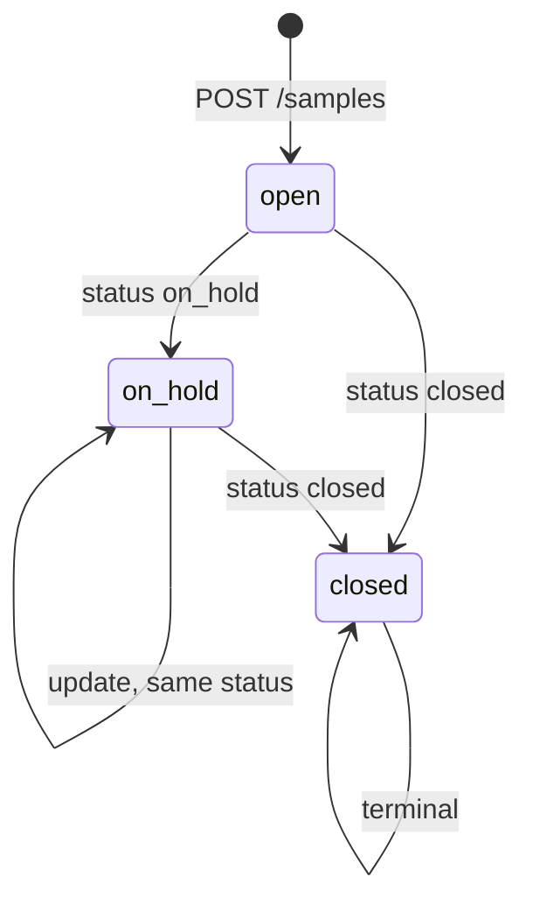

# State Machine Codegen — go-boilerplate-clean

Generate **status workflows** for entities with a `status` field. This repo’s full reference is **sample** (wired, HTTP, DB, Kafka).

**Module path:** `go-boilerplate-clean`  
**Also read:** [codegen.md](./codegen.md), [AGENTS.md](../AGENTS.md)

---

## Reference layout (sample — complete)

```
internal/entity/sample/sample.go          # entity + SampleStatus* constants

internal/repository/sample/
├── sample_repository.go                # Add, GetByID, Update
├── model/sample.go
└── postgres/repository.go

internal/usecase/sample/
├── saver.go                            # SampleService, interfaces, Save()
├── getter.go                           # SampleGetter → repo.GetByID
├── errors.go
├── states/
│   ├── state.go                        # factory, ISampleState*, stateMachineSample
│   ├── open.go
│   ├── on_hold.go
│   └── closed.go
├── on_open/on_open.go                  # IOnStateTransition (creation / stay open)
├── on_pending/on_pending.go            # → on_hold
└── on_closed/on_closed.go              # → closed

internal/infrastructure/broker/kafka/sample_event_publisher.go

internal/transport/apis/
├── dto/sample_request.go
├── handler/sample_handler.go           # Create, Update → Save()
└── router.go                           # POST /samples, PUT /samples/:id

internal/bootstrap/wire.go                # wireSampleService
```

---

## When to use a state machine

Use when:

- **Status** changes follow business rules (not arbitrary field patches).
- Transitions need **different side effects** per target status.
- Save must be **atomic** (DB transaction).

Skip for plain CRUD — use `internal/usecase/users` only.

**Live API:** `POST /samples`, `PUT /samples/:id` via `SampleService.Save`.

---

## Create vs update

| Path | HTTP | `current` for factory | Persist | ID |
|------|------|------------------------|---------|-----|
| **Create** | `POST /samples` | `&request` (no ID) | `adder.Add` | UUID in repo `Add` |
| **Update** | `PUT /samples/:id` | `getter.Get(id)` from DB | `updater.Update` | From URL |

Factory rules (`NewStateMachine(ctx, current)`):

1. **Empty ID is valid on create** — do not require ID before `Add`.
2. **Default status** — if `current.Status == ""`, set initial status (e.g. `open`) before `switch current.Status`.
3. **State machine runs inside the transaction**, before `Add`/`Update`.
4. **Publish after commit** — sample **returns publish errors to the caller** (exception; see § Kafka publish semantics).

```
Save:
  ID set? → getter.Get → current
  current nil? → create: current = &request, storeFunc = Add
  else → update: storeFunc = Update
  NewStateMachine(current)
  Begin → Do → Add/Update → Commit → Publish
```

---

## Status diagram (sample)



| Constant | Value |
|----------|-------|
| `SampleStatusOpen` | `open` |
| `SampleStatusOnHold` | `on_hold` |
| `SampleStatusClosed` | `closed` |

### Transition routing (from `open` state)

| Request `status` | Handler |
|------------------|---------|
| `on_hold` | `onPending` → `on_pending` package |
| `closed` | `onClosed` → `on_closed` package |
| default / `open` | `onCreation` → `on_open` package |

---

## Prompt template

```markdown
Generate a state machine for `{domain}` in go-boilerplate-clean.
Read docs/statemachine.md and mirror internal/usecase/sample.

## Transitions
| From (current) | To (request status) | Handler package |
|----------------|---------------------|-----------------|
| {from}         | {to}                | on_{name}/      |

## Entity
- internal/entity/{domain}/{entity}.go
- Constants: {Entity}Status{Name} = "{value}"

## Deliverables
- internal/repository/{domain}/ (Add, GetByID, Update)
- internal/usecase/{domain}/saver.go, getter.go, states/*, on_*/
- internal/transport/apis/ (Save DTO, handler, routes)
- internal/bootstrap/wire.go → wire{Domain}Service
- AutoMigrate new model
- Kafka publisher (optional): follow sample or user event DTO pattern
- go build ./...
```

---

## Core interfaces (`states/state.go`)

### `ISampleState` / `ISampleStateMachine`

```go
type ISampleState interface {
    Do(ctx context.Context, tx *gorm.DB, update sample.Sample) (sample.Sample, error)
}

type ISampleStateMachine interface {
    ISampleState
    Sample() *sample.Sample
}
```

### Factory (wired from saver)

```go
// states package — implemented by stateMachineFactorySample
NewStateMachine(ctx context.Context, current *sample.Sample) (ISampleStateMachine, error)

// saver.go — dependency
type NewSampleStateMachine interface {
    NewStateMachine(ctx context.Context, current *entitysample.Sample) (states.ISampleStateMachine, error)
}
```

Transaction `tx` is passed to `Do`, not to `NewStateMachine`.

### `IOnStateTransition`

```go
type IOnStateTransition interface {
    OnStateTransition(ctx context.Context, tx *gorm.DB, update sample.Sample) (sample.Sample, error)
}
```

| Factory arg | Package | Role |
|-------------|---------|------|
| `onCreation` | `on_open` | default / stay in `open` |
| `onPending` | `on_pending` | target `on_hold` |
| `onClosed` | `on_closed` | target `closed` |

Wire in `wireSampleService`:

```go
states.NewSampleStateMachineFactory(
    on_open.NewOnOpen(),
    on_pending.NewOnPending(),
    on_closed.NewOnClosed(),
)
```

---

## Per-state file pattern

1. Private struct + `stateMachine *stateMachineSample` + transition handlers.
2. In `Do`: `s.stateMachine.data = &update`.
3. `switch update.Status` (target from request) → call `OnStateTransition`.
4. Illegal transitions: return error inside handler, not in HTTP layer.

---

## Saver interfaces (`saver.go`)

| Interface | Implementation in sample |
|-----------|---------------------------|
| `SampleAdder` | `SampleRepository.Add` |
| `SampleGetter` | `NewSampleGetter(repo)` |
| `SampleUpdater` | `SampleRepository.Update` |
| `NewSampleStateMachine` | `stateMachineFactorySample` |
| `TransactionManager` | `begin.BeginRepository` |
| `SamplePublisher` | `SampleEventPublisherKafka` |
| `SampleService` | `sampleSaver.Save` |

**Transaction defer:** rollback only when `err != nil` after `Begin` (same pattern as users).

**Publish:** after successful `Commit`; failure fails `Save` (unlike users which only log).

---

## Kafka publish semantics (sample exception)

State-machine domains use the **same producer wiring** as CRUD ([codegen.md](./codegen.md) § Event publishing) but **different failure semantics**:

| Behavior | CRUD (`users`, new domains) | State machine (`sample`, `order`, …) |
|----------|----------------------------|--------------------------------------|
| Trigger | `Create` and `Update` usecases | `Save` after workflow + `Commit` |
| On publish error | `log.Printf(...)`; return persisted entity to HTTP **success** | `return entity, err` from `Save` → handler maps to HTTP error |
| Event naming (new work) | One `{Domain}Event` + `event_type` for CRUD (see [codegen.md](./codegen.md)) | May use full entity JSON (as sample) or `{Domain}Event` on save |
| Code reference | `internal/usecase/users/user_usecase.go` | `internal/usecase/sample/saver.go` |

```go
// sample/saver.go — stricter: publish failure surfaces to API
if err := s.publisher.Publish(ctx, updated); err != nil {
    return entitysample.Sample{}, err
}
```

**Agents:** when adding a **new CRUD** domain, use one **`{Domain}Event`** with `event_type` and **log-on-failure**. When adding a **state-machine** domain, follow sample’s **return publish error** rule unless product spec says otherwise.

---

## HTTP layer

**DTO** (`SaveSampleRequest`): `code`, `name`, `email`, `status` → `ToEntity()`.

**Handler:** bind DTO → `service.Save(ctx, entity)`; set `entity.ID` from path on update.

Do not branch on status in the handler.

---

## Bootstrap (`wireSampleService`)

```go
sampleRepo := samplepg.NewSampleRepository(db)
txManager := beginpg.NewBeginRepository(db)
factory := states.NewSampleStateMachineFactory(...)
publisher := kafkainfra.NewSampleEventPublisherKafka(producer)
return usecasesample.NewSampleSaver(factory, txManager, sampleRepo, getter, sampleRepo, publisher)
```

Register in `app.go` and pass to `newEcho(userService, sampleService)`.

---

## New domain checklist

- [ ] Status constants in `internal/entity/{domain}/`
- [ ] Repository: `Add`, `GetByID`, `Update` + `AutoMigrate`
- [ ] `states/state.go` + one file per status
- [ ] `on_*` handlers for each transition type
- [ ] `saver.go`: interfaces + `Save` orchestration
- [ ] `getter.go` wrapping repository
- [ ] HTTP: DTO, handler (`POST` + `PUT`), `router.go`
- [ ] `wire{Domain}Service` + `app.go` / `server.go`
- [ ] Kafka publisher (if required)
- [ ] `go build ./...`

---

## Anti-patterns

| Don't | Do |
|-------|-----|
| Status logic in Echo handler | `handler` → `Save` only |
| `postgres` import in `states` | entity + `gorm.DB` only |
| Set `status` in repository | status via state machine `Do` |
| One huge `states` file | split per status + `state.go` |
| Skip `stateMachine.data = &update` in `Do` | always assign at start of `Do` |
| Require ID in factory on create | allow empty ID; UUID on `Add` |

---

## AI examples

> Build **order** state machine: `draft` → `submitted` → `cancelled`. Follow docs/statemachine.md and `internal/usecase/sample`. Wire HTTP and Kafka.

> Add `archived` to **sample**: only from `closed`, new `on_archived` handler, update entity constants and all `switch`es.

---

## Related

- [codegen.md](./codegen.md) — layers, Kafka styles, bootstrap  
- [AGENTS.md](../AGENTS.md) — agent entry point and file map  
- Code: `internal/usecase/sample/saver.go`, `internal/usecase/sample/states/state.go`
